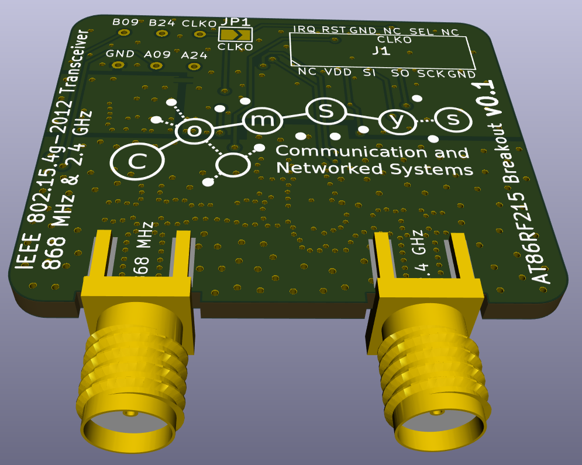

AT86RF215 Breakout Board
========================

This Repository contains an minimal AT86RF215 breakout board. The pin header
is compatible to the openlabs.co Raspberry Pi 802.15.4 radio. However, this
will not be a drop-in replacement as the software needs adjustment.

WARNING
=======

1. The PCB contains no shielding for the RF filter, which will result in lower
   sensitivity and higher noise in the transmitted signal compared to e.g. the
   AT86RF215-XPRO reference design.
2. It is highly recommended to not order PCBs based on this design as of now.
   While an earlier version seems to work flawlessly, this revision has not been
   tested yet.
3. There is absolutely no warranty.
